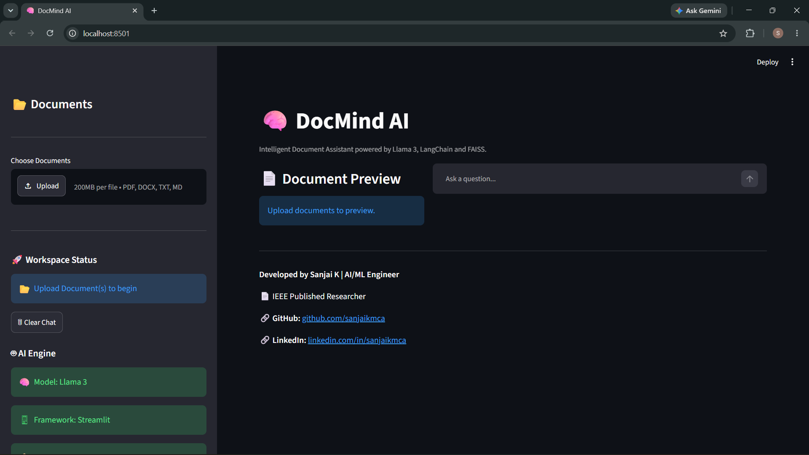
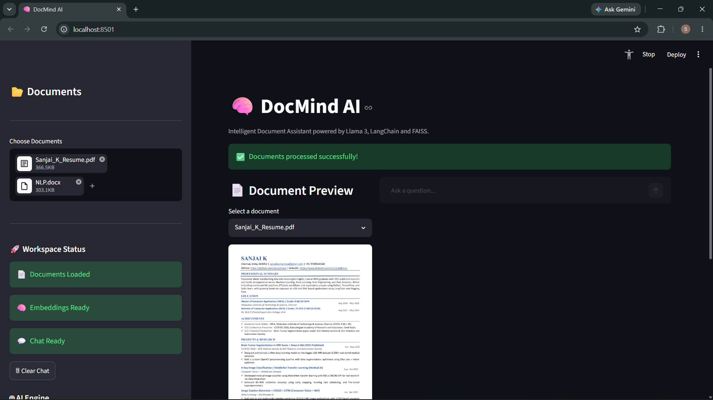
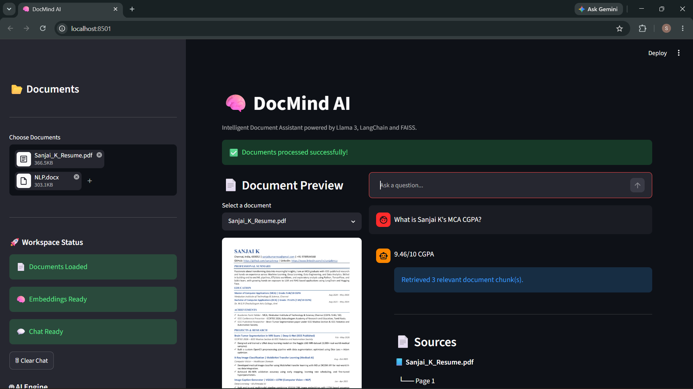
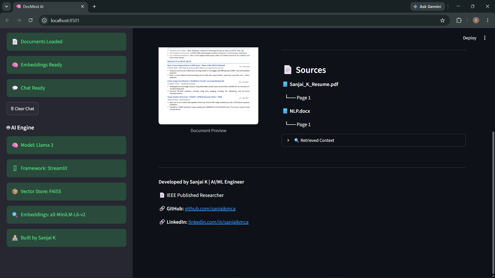
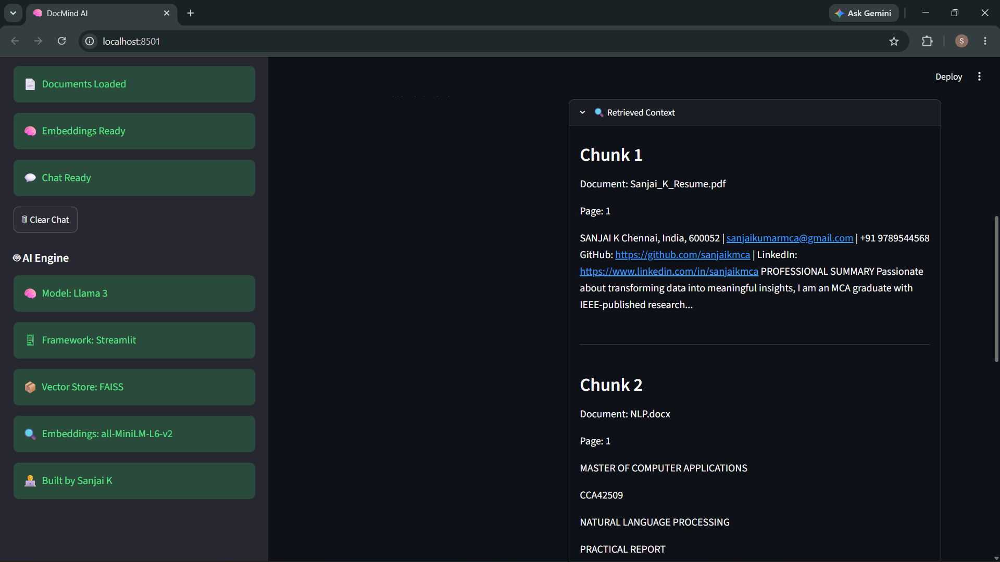

#  DocMind AI


## 🚀 Intelligent Multi-Document Question Answering System using RAG, Llama 3, LangChain and FAISS

DocMind AI is an AI-powered **Multi-Document Question Answering System** that enables users to upload multiple document formats and interact with them using natural language.

The application leverages **Retrieval-Augmented Generation (RAG)** to retrieve the most relevant information from uploaded documents through **FAISS semantic search** and generates accurate, context-aware answers using **Llama 3** running locally with **Ollama**.

Users can upload multiple documents, ask questions, view retrieved sources, inspect supporting context, and interact through a clean and intuitive Streamlit interface.

---

# ✨ Features

- 📄 Upload multiple documents (PDF, DOCX, TXT, Markdown)
- 🤖 Natural language question answering
- 🧠 Retrieval-Augmented Generation (RAG)
- 🔍 Semantic document retrieval using FAISS
- 💬 Llama 3 powered answer generation
- 📄 PDF preview for uploaded documents
- 📚 Source citations with page numbers
- 🔍 Retrieved context viewer
- ⚡ Fast document processing
- 🌐 Local inference using Ollama
- 🎨 Interactive Streamlit interface
- 🧩 Modular project architecture

---

# 🛠 Tech Stack

| Category | Technology |
|-----------|------------|
| Programming Language | Python |
| UI Framework | Streamlit |
| LLM | Llama 3 (Ollama) |
| RAG Framework | LangChain |
| Embedding Model | all-MiniLM-L6-v2 |
| Vector Store | FAISS |
| Document Processing | PyMuPDF, Docx2txtLoader, TextLoader |
| Embeddings | Sentence Transformers |

---

# 🏗️ System Architecture

```text
PDF / DOCX / TXT / Markdown
              │
              ▼
        Document Loader
              │
              ▼
        Text Extraction
              │
              ▼
      Document Chunking
              │
              ▼
Sentence Transformer Embeddings
              │
              ▼
       FAISS Vector Store
              │
              ▼
 Semantic Context Retrieval
              │
              ▼
      Llama 3 (Ollama)
              │
              ▼
 Generated Answer + Source Citations
```

---

# 📂 Project Structure

```text
DocMind-AI/
│
├── app.py
├── requirements.txt
├── README.md
├── LICENSE
├── .gitignore
│
├── utils/
│   ├── __init__.py
│   ├── chatbot.py
│   ├── config.py
│   ├── document_processor.py
│   ├── document_viewer.py
│   ├── embeddings.py
│   ├── loader.py
│   ├── splitter.py
│   ├── ui_helpers.py
│   └── vector_store.py
│
├── data/
│
└── assets/
```

---

# 🚀 Installation

## 1️⃣ Clone the repository

```bash
git clone https://github.com/sanjaikmca/DocMind-AI.git
```

## 2️⃣ Navigate to the project

```bash
cd DocMind-AI
```

## 3️⃣ Install dependencies

```bash
pip install -r requirements.txt
```

## 4️⃣ Install Ollama

Download Ollama from:

https://ollama.com

Pull the Llama 3 model:

```bash
ollama pull llama3
```

Run the model:

```bash
ollama run llama3
```

## 5️⃣ Launch the application

```bash
streamlit run app.py
```

---

# 💡 How to Use

1. Launch **DocMind AI**.
2. Upload one or more documents (PDF, DOCX, TXT, or Markdown).
3. Wait while the application processes the uploaded documents.
4. Ask questions in natural language.
5. View the generated answer.
6. Review the retrieved context and source citations.

---

# 📸 Screenshots

## 🏠 Home Page



---

## 📤 Upload Documents

Upload and process multiple documents in different supported formats.



---

## 💬 Question Answering

Ask questions in natural language and receive context-aware answers powered by Retrieval-Augmented Generation (RAG).



---

## 📚 Source Citations

View the source document and page number used to generate each response.



---

## 🔍 Retrieved Context

Inspect the retrieved document chunks used by the LLM before answer generation.



---

# 🎯 Key Highlights

- Multi-document support
- Retrieval-Augmented Generation (RAG)
- Local Llama 3 inference using Ollama
- FAISS semantic search
- Context-aware responses
- Source attribution with page numbers
- Retrieved context inspection
- Interactive Streamlit interface
- Modular and scalable architecture

---

# 🔮 Future Enhancements

- OCR support for scanned documents
- Hybrid Search (BM25 + FAISS)
- Conversation memory
- Multi-model support
- Authentication and user accounts
- Chat history export
- Answer confidence scoring
- Web deployment
- Enhanced document preview

---

# 👨‍💻 Developer

## Sanjai K

**Machine Learning Engineer**

- 🎓 Master of Computer Applications (MCA)
- 📄 IEEE Published Researcher
- 🤖 Passionate about Machine Learning, Generative AI, LLMs, RAG Systems, and AI Applications

### 🌐 Connect with Me

- **Portfolio:** https://sanjaikmca.github.io/Sanjai_Portfolio/
- **GitHub:** https://github.com/sanjaikmca
- **LinkedIn:** https://www.linkedin.com/in/sanjaikmca

---

# 🤝 Contributing

Contributions, suggestions, and improvements are welcome.

Feel free to fork the repository and submit a Pull Request.

---

# 📜 License

This project is licensed under the **MIT License**.

---

## ⭐ Support

If you found this project useful, consider giving it a ⭐ on GitHub.

It helps others discover the project and supports future improvements.

Thank you for visiting **DocMind AI**! 🚀
